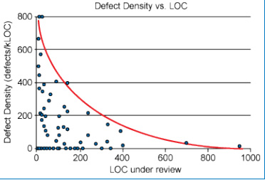

代码审查（Code Review)是软件开发中常用的手段，和QA测试相比，它更容易发现和架构以及时序相关等较难发现的问题，还可以帮助团队成员提高编程技能，统一编程风格等。

<!--more-->

# 代码审查要求团队有良好的文化
团队需要认识到代码审查是为了提高整个团队的能力，而不是针对个体设置的检查“关卡”。
“A的代码有个bug被B发现，所以A能力不行，B能力更好”，这一类的陷阱很容易被扩散从而影响团队内部的协作，因此需要避免。
另外，代码审查本身可以提高开发者的能力，让其从自身犯过的错误中学习，从他人的思路中学习。如果开发者对这个流程有抵触或者反感，这个目的就达不到。

# 谨慎的使用审查中问题的发现率作为考评标准

在代码审查中如果发现问题，对于问题的发现者来说这是好事，应该予以鼓励。但对于被发现者，我们不主张使用这个方式予以惩罚。软件开发中bug在所难免，过度苛求本身有悖常理。更糟的是，如果造成参与者怕承担责任，不愿意在审查中指出问题，代码审查就没有任何的价值和意义。

# 控制每次审查的代码数量
根据smartbear在思科所作的调查，每次审查200行-400行的代码效果最好。每次试图审查的代码过多，发现问题的能力就会下降，具体的比例关系如下图所示：

我们在实践中发现，随着开发平台和开发语言的不同，最优的代码审查量有所不同。但是限制每次审查的数量确实非常必要，因为这个过程是高强度的脑力密集型活动。时间一长，代码在审查者眼里只是字母，无任何逻辑联系，自然不会有太多的产出。

# 带着问题去进行审查
我们在每次代码审查中，要求审查者利用自身的经验先思考可能会碰到的问题，然后通过审查工作验证这些问题是否已经解决。一个窍门是，从用户可见的功能出发，假设一个比较复杂的使用场景，在代码阅读中验证这个使用场景是否能够正确工作。
使用这个技巧，可以让审查者有代入感，真正的沉浸入代码中，提高效率。大家都知道看武侠小说不容易瞌睡，而看专业书容易瞌睡，原因就是武侠小说更容易产生代入感。
有的研究建议每次树立目标，控制单位时间内审核的代码数量。这个方法在我们的实践中显得很机械和流程化，不如上面的方法效果好。

# 所有的问题和修改，必须由原作者进行确认
如果在审查中发现问题，务必由原作者进行确认。
这样做有两个目的：
(1)确认问题确实存在，保证问题被解决
(2)让原作者了解问题和不足，帮助其成长
有些时候为了追求效率，有经验的审查者更倾向于直接修改代码乃至重构所有代码，但这样不利于提高团队效率，并且会增加因为重构引入新bug的几率，通常情况下我们不予鼓励。

# 利用代码审查激活个体“能动性"
即使项目进度比较紧张，无法完全的进行代码审查，至少也要进行部分代码的审查，此时随即抽取一些关键部分是个不错的办法。
背后的逻辑是，软件开发是非常有创造性的工作，开发者都有强烈的自我驱动性和自我实现的要求。让开发者知道他写的任何代码都可能被其他人阅读和审察，可以促使开发者集中注意力，尤其是避免将质量糟糕，乃至有低级错误的代码提交给同伴审查。开源软件也很好的利用了这种心态来提高代码质量。

# 在非正式，轻松的环境下进行代码审查
如前所述，代码审查是一个脑力密集型的工作。参与者需要在比较轻松的环境下进行该工作。因此，我们认为像某些实践中建议的那样，以会议的形式进行代码审查效果并不好，不仅因为长时间的会议容易让效率低下，更因为会议上可能出现的争议和思考不利于进行如此复杂的工作。

# 提交代码前自我审查，添加对代码的说明
所有团队成员在提交代码给其他成员审查前，必须先进行一次审查。这次自我修正形式的审查除了检查代码的正确性以外，还可以完成如下的工作：
(1)对代码添加注释，说明本次修改背后的原因，方便其他人进行审查。
(2)修正编码风格，尤其是一些关键数据结构和方法的命名，提高代码的可读性。
(3)从全局审视设计，是否完整的考虑了所有情景。在实现之前做的设计如果存在考虑不周的情况，这个阶段可以很好的进行补救。
我们在实践中发现，即使只有原作者进行代码审查，仍然可以很好的提高代码质量。

# 实现中记录笔记可以很好的提高问题发现率
成员在编码的时候应做随手记录，包括在代码中用注释的方式表示，或者记录简单的个人文档，这样做有几个好处：  
(1)避免遗漏。在编码时将考虑到的任何问题都记录下来，在审查阶段再次检查这些问题都确认解决。 
(2)根据研究，每个人都习惯犯一些重复性的错误。这类问题在编码是记录下来，可以在审查的时候用作检查的依据。
(3)在反复记录笔记并在审查中发现类似的问题后，该类问题出现率会显著下降

# 使用好的工具进行轻量级的代码审查
“工欲善其事，必先利其器”。我们使用的是bitbucket提供的代码托管服务。
每个团队成员独立开发功能，然后利用Pull Request的形式将代码提交给审查者。复审者可以很方便在网页上阅读代码，添加评论等，然后原作者会自动收到邮件提醒，对审阅的意见进行讨论。
即使团队成员分布在天南海北，利用bitbucket提供的工具也能很好的进行代码审查。

> 原文：http://www.html5cn.org/article-4001-1.html  
> ——转摘自互联网

---
<link rel="stylesheet" href="http://yandex.st/highlightjs/6.1/styles/default.min.css">

