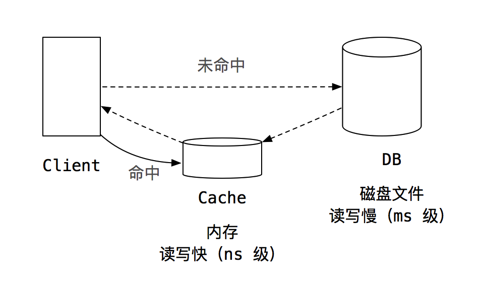
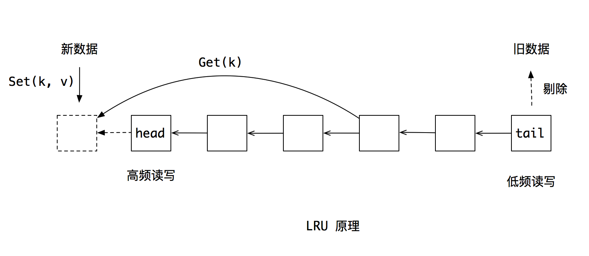
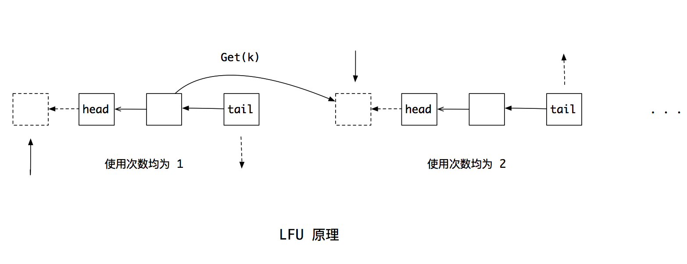
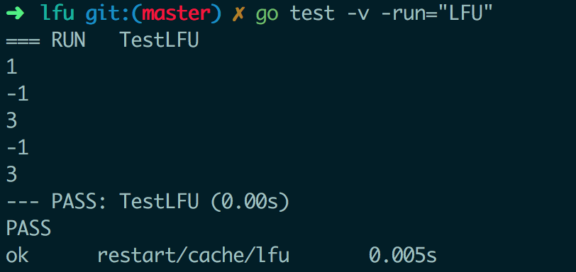

<!--more-->
<!-- 1. 发布前：删除草稿的 uuid -->
<!-- 2. 发布后：补充tag，category -->

LRU 与 LFU 缓存策略及其实现。

## 应用层缓存



鉴于磁盘和内存读写的差异性，DB 中低频写、高频读的数据适合放入内存中，直接供应用层读写。在项目中读取用户资料时就使用到了 LRU，而非放到 Redis 中。

### 缓存的 2 个基本实现

```go
Set(key string, value interface) // 写数据
Get(key string) interface{}      // 读数据
```

### 缓存的 2 个特征

- 命中率：即命中数 / 请求数，比值越高即表明缓存使用率越高，缓存更有效。
- 淘汰策略：内存空间是有限的，当缓存数据占满内存后，若要缓存新数据，则必须淘汰一部分**旧**数据。对于**旧** 的概念，不同淘汰策略有不同原则。

下边介绍两种常用的淘汰算法：LRU 与 LFU

## LRU

缩写：Least Recently Used（ 最近 最久 使用），时间维度

原则：若数据在最近一段时间内都未使用（读取或更新），则以后使用几率也很低，应被淘汰。

### 数据结构

- 使用链表：由于缓存读写删都是高频操作，考虑使用写删都为 O(1) 的**链表**，而非写删都为 O(N) 的数组。
- 使用双链表：选用删除操作为 O(1) 的**双链表**而非删除为 O(N) 的单链表。
- 维护额外哈希表：链表查找必须遍历  O(N) 读取，可在缓存中维护 `map[key]*Node` 的**哈希表**来实现O(1) 的链表查找。



直接使用链表节点存储缓存的 K-V 数据，链表从 head 到 tail 使用频率逐步降低。新访问数据不断追加到 head 前边，旧数据不断从 tail 剔除。LRU 使用链表顺序性保证了热数据在 head，冷数据在 tail。

双链表节点存储 K-V 数据：

```go
type Node struct {
	key        string // 淘汰 tail 时需在维护的哈希表中删除，不是冗余存储
	val        interface{}
	prev, next *Node // 双向指针
}

type List struct {
	head, tail *Node
	size       int // 缓存空间大小
}
```

从上图可知，双链表需实现缓存节点新增 `Prepend`，剔除 `Remove` 操作：

```go
func (l *List) Prepend(node *Node) *Node {
	if l.head == nil {
		l.head = node
		l.tail = node
	} else {
		node.prev = nil
		node.next = l.head
		l.head.prev = node
		l.head = node
	}
	l.size++
	return node
}

func (l *List) Remove(node *Node) *Node {
	if node == nil {
		return nil
	}
	prev, next := node.prev, node.next
	if prev == nil {
		l.head = next // 删除头结点
	} else {
		prev.next = next
	}

	if next == nil {
		l.tail = prev // 删除尾结点
	} else {
		next.prev = prev
	}

	l.size--
	node.prev, node.next = nil, nil
	return node
}

// 封装数据已存在缓存的后续操作
func (l *List) MoveToHead(node *Node) *Node {
	if node == nil {
		return nil
	}
	n := l.Remove(node)
	return l.Prepend(n)
}

func (l *List) Tail() *Node {
	return l.tail
}

func (l *List) Size() int {
	return l.size
}
```

### LRU 操作细节

`Set(k, v)`

- 数据已缓存，则更新值，挪到 head 前
- 数据未缓存
  - 缓存空间未满：直接挪到 head 前
  - 缓存空间已满：移除 tail 并将新数据挪到 head 前

`Get(k)`

- 命中：节点挪到 head 前，并返回 value
- 未命中：返回 -1

代码实现：

```go
type LRUCache struct {
	capacity int // 缓存空间大小
	items    map[string]*Node
	list     *List
}

func NewLRUCache(capacity int) *LRUCache {
	return &LRUCache{
		capacity: capacity,
		items:    make(map[string]*Node),
		list:     new(List),
	}
}

func (c *LRUCache) Set(k string, v interface{}) {
	// 命中
	if node, ok := c.items[k]; ok {
		node.val = v                         // 命中后更新值
		c.items[k] = c.list.MoveToHead(node) //
		return
	}

	// 未命中
	node := &Node{key: k, val: v} // 完整的 node
	if c.capacity == c.list.size {
		tail := c.list.Tail()
		delete(c.items, tail.key) // k-v 数据存储与 node 中
		c.list.Remove(tail)
	}
	c.items[k] = c.list.Prepend(node) // 更新地址
}

func (c *LRUCache) Get(k string) interface{} {
	node, ok := c.items[k]
	if ok {
		c.items[k] = c.list.MoveToHead(node)
		return node.val
	}
	return -1
}
```


### 测试

```go
func TestLRU(t *testing.T) {
	c := NewLRUCache(2)
	c.Set(K1, 1)
	c.Set(K2, 2)
	c.Set(K1, 100)
	fmt.Println(c.Get(K1)) // 100
	c.Set(K3, 3)
	fmt.Println(c.Get(K2)) // -1
	c.Set(K4, 4)
	fmt.Println(c.Get(K1)) // -1
	fmt.Println(c.Get(K3)) // 3
	fmt.Println(c.Get(K4)) // 4
}
```


## LFU

缩写：Least Frequently Used（最近 最少 使用），频率维度。

原则：若数据在最近一段时间内使用次数少，则以后使用几率也很低，应被淘汰。

对比 LRU，若缓存空间为 3 个数据量：

```go
Set("2", 2)
Set("1", 1)
Get(1)
Get(2)
Set("3", 3) 
Set("4", 4) // LRU 将淘汰 1，缓存链表为 4->3->2
	    // LFU 将淘汰 3，未超出容量的时段内 1 和 2 都被使用了两次，3 仅使用一次
```

### 数据结构

依旧使用双向链表实现高效写删操作，但 LFU 淘汰原则是 **使用次数**，数据节点在链表中的位置与之无关。可按使用次数划分 **频率梯队**，数据节点使用一次就挪到高频梯队。此外维护 `minFreq` 表示最低梯队，维护 2 个哈希表：

- `map[freq]*List`  各频率及其链表
- `map[key]*Node` 实现数据节点的 O(1) 读 



双链表存储缓存数据：

```go
type Node struct {
	key        string
	val        interface{}
	freq       int // 将节点从旧梯队移除时使用，非冗余存储
	prev, next *Node
}

type List struct {
	head, tail *Node
	size       int
}
```


### LFU 操作细节

`Set(k, v)`

- 数据已缓存，则更新值，挪到下一梯队
- 数据未缓存
  - 缓存空间未满：直接挪到第 1 梯队
  - 缓存空间已满：移除 minFreq 梯队的 **tail 节点**，并将新数据挪到第 1 梯队

`Get(k)`

- 命中：节点挪到下一梯队，并返回 value
- 未命中：返回 -1

如上的 5 种 case，都要维护好对 `minFreq` 和 2 个哈希表的读写。

代码实现：

```go
type LFUCache struct {
	capacity int
	minFreq  int // 最低频率

	items map[string]*Node
	freqs map[int]*List // 不同频率梯队
}

func NewLFUCache(capacity int) *LFUCache {
	return &LFUCache{
		capacity: capacity,
		minFreq:  0,
		items:    make(map[string]*Node),
		freqs:    make(map[int]*List),
	}
}

func (c *LFUCache) Get(k string) interface{} {
	node, ok := c.items[k]
	if !ok {
		return -1
	}

	// 移到 +1 梯队中
	c.freqs[node.freq].Remove(node)
	node.freq++
	if _, ok := c.freqs[node.freq]; !ok {
		c.freqs[node.freq] = NewList()
	}
	newNode := c.freqs[node.freq].Prepend(node)
	c.items[k] = newNode // 新地址更新到 map
	if c.freqs[c.minFreq].Size() == 0 {
		c.minFreq++ // Get 的正好是当前值
	}
	return newNode.val
}

func (c *LFUCache) Set(k string, v interface{}) {
	if c.capacity <= 0 {
		return
	}

	// 命中，需要更新频率
	if val := c.Get(k); val != -1 {
		c.items[k].val = v // 直接更新值即可
		return
	}

	node := &Node{key: k, val: v, freq: 1}

	// 未命中
	// 缓存已满
	if c.capacity == len(c.items) {
		old := c.freqs[c.minFreq].Tail() // 最低最旧
		c.freqs[c.minFreq].Remove(old)
		delete(c.items, old.key)
	}

	// 缓存未满，放入第 1 梯队
	c.items[k] = node
	if _, ok := c.freqs[1]; !ok {
		c.freqs[1] = NewList()
	}
	c.freqs[1].Prepend(node)
	c.minFreq = 1
}
```

`minFreq` 和 2 个哈希表的维护使 LFU 比 LRU 更难实现。

### 测试

```go
func TestLFU(t *testing.T) {
	c := NewLFUCache(2)
	c.Set(K1, 1)           // 1:K1
	c.Set(K2, 2)           // 1:K2->K1	
	fmt.Println(c.Get(K1)) // 1:K2 2:K1 // 1
	c.Set(K3, 3)           // 1:K3 2:K1
	fmt.Println(c.Get(K2)) // -1
	fmt.Println(c.Get(K3)) // 2:k3->k1  // 3
	c.Set(K4, 4)           // 1:K4 2:K3
	fmt.Println(c.Get(K1)) // -1
	fmt.Println(c.Get(K3)) // 1:K4 3:K3 // 3
}
```



## 总结

常见的缓存淘汰策略有队列直接实现的 FIFO，双链表实现的 LFU 与 LRU，此外还有扩展的 2LRU 与 ARC 等算法，它们的实现不依赖于任意一种数据结构，此外对于旧数据的衡量原则不同，淘汰策略也不一样。

在算法直接实现难度较大的情况下，不妨采用空间换时间，或时间换空间的策略来间接实现。要充分利用各种数据结构的优点并互补，比如链表加哈希表就实现了任意操作 O(1) 复杂度的复合数据结构。


---

