# 图灵测试

1950年，图灵发表一篇名为《计算机器与智能》的论文，被誉为人工智能科学的开山之作。文中提出了图灵测试。

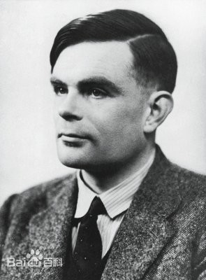

## 机器能思考么？

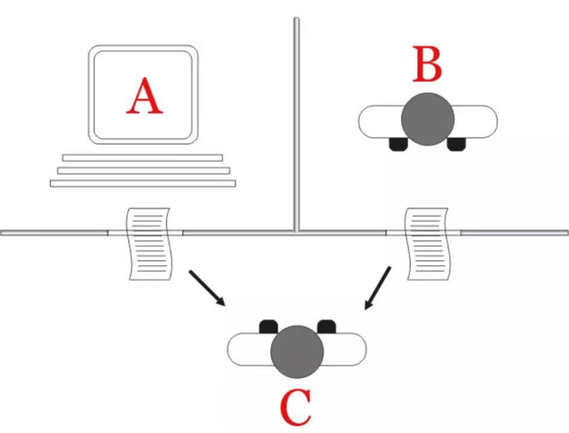

> 换言之，男人 --> 机器，询问者判断错误的概率会不会发生变化？
>
> 图灵测试的目的：提供一个评估“机器能否思维”的方法。

## 70年后，仿佛它来了？

# ChatGPT

目前最接近“六边形”战士的聊天机器人。

ChatGPT（Chat Generative Pre-Trained Transformer）是由OpenAI开发的人工智能聊天机器人程序，其基于GPT-3.5大模型，能够完成相对复杂的语言处理任务，包括人机对话、自动文本生成、自动摘要、编写代码等，在2022年11月推出，上线两个月后用户数量即达到1亿规模，在全球范围内掀起又一轮AI热潮。

## 令人惊艳的能力

### 帮你安慰女友

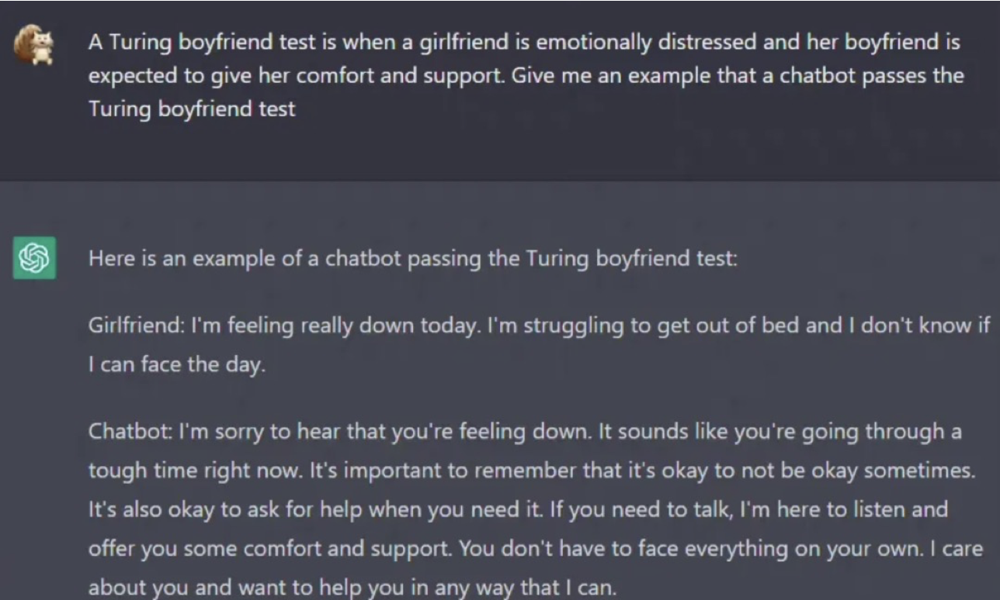

### 写电影故事

### 有逻辑地回答文史问题

### 协助程序员工作

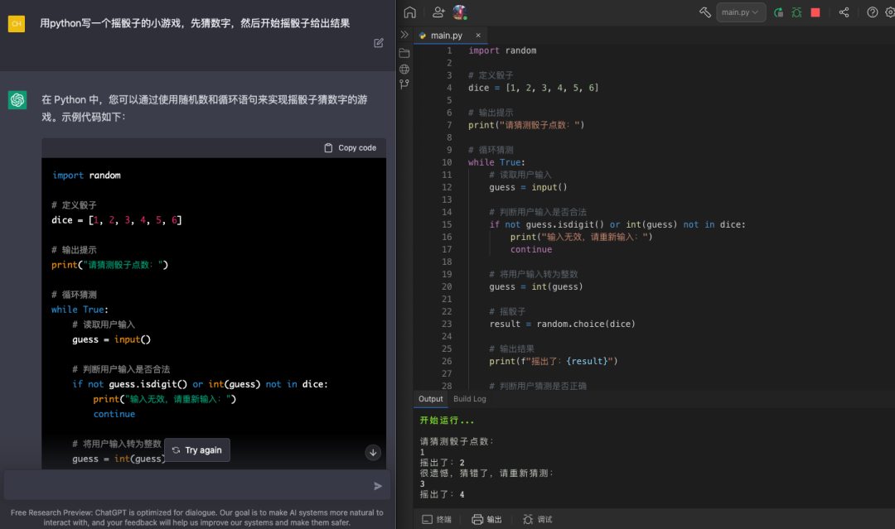

### 干掉程序员的工作

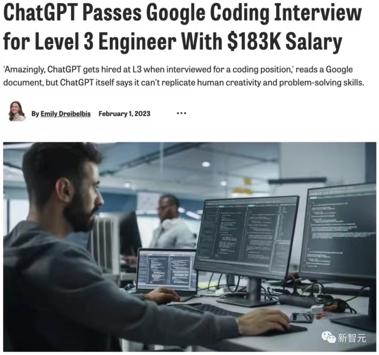

### 哲学思考，我们如何过好这一生？

## 为什么这么牛？

- 有上下文记忆能力：多轮对话衔接地很好，很难看出是机器生成的；
- 有学习纠错能力：在它回答错误之后，如果你纠正了它，第二次就不会再答错；
- 有思维推理能力：具备一些常识知识，能做复杂一些的算数题；

### 数据

| 维度                  | 初代GPT                    | GPT-2        | GPT-3        |
| --------------------- | -------------------------- | ------------ | ------------ |
| 时间                  | 2018年6月                  | 2019年2月    | 2020年5月    |
| 参数量                | 1.17亿                     | 15.4亿       | 1750亿       |
| 预训练数据量          | 5GB                        | 40GB         | 45TB         |
| 训练方式              | Pre-training + Fine-tuning | Pre-training | Pre-training |
| 序列长度              | 512                        | 1024         | 2048         |
| # of Decoder Layers   | 12                         | 48           | 96           |
| Size of Hidden Layers | 768                        | 1600         | 12288        |

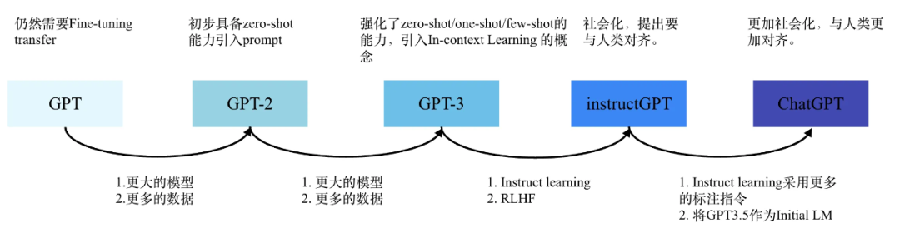

### 原理

先问ChatGPT——你是谁？

它是这样解释的：

> GPT是基于**Transformer**架构的预训练语言模型，可以生成自然语言文本。**Transformer**是基于自注意力机制的**深度学习模型架构**，它在自然语言处理领域中得到了广泛的应用，如**机器翻译**、**文本分类**和**生成模型**等。
>
> GPT是基于**Transformer**模型的改进版本，主要是针对生成任务进行了优化，通过预训练学习自然语言的语义和语法规律，进而生成高质量的文本。
>
> 因此，GPT可以看作是**Transformer**模型在生成任务上的一个**应用扩展**。

#### Transformer

短短的自我介绍中，ChatGPT就**四次**提到**Transformer**是啥？

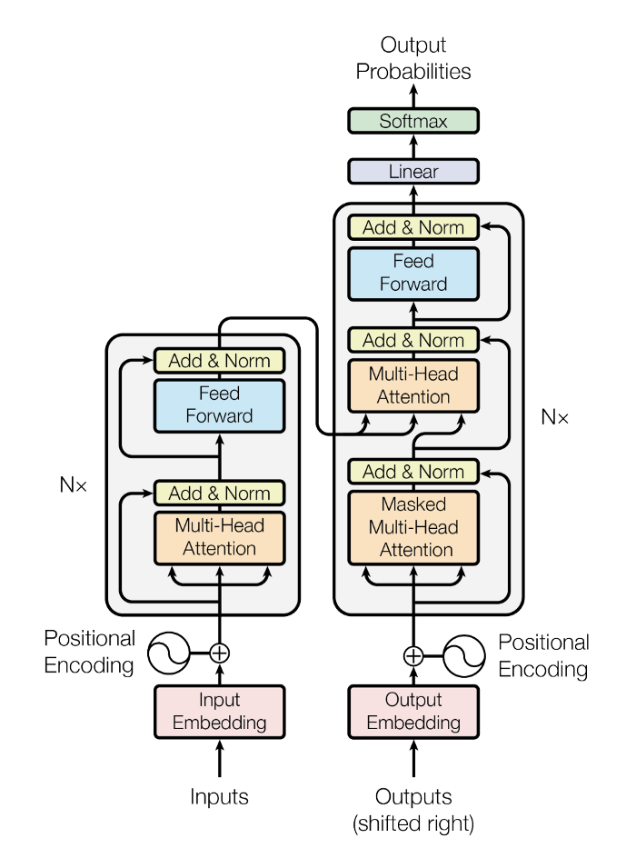

Transformer：用于**自然语言处理**（NLP）的**神经网络架构**。

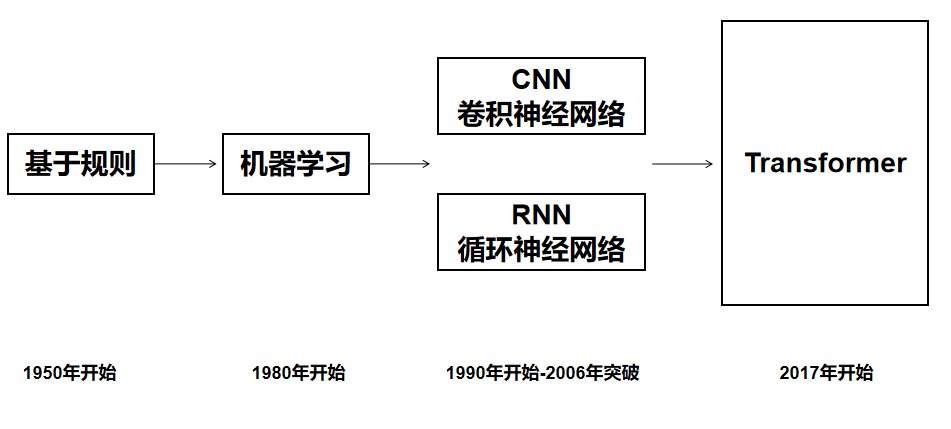

Transformer架构使用了**注意力机制**，能够处理**长序列**的依赖关系。

这让它具有以下明显优点：

> **❶并行计算**：由于自注意力机制的引入，Transformer可以实现并行计算，加快训练速度。
>
> **❷长序列处理**：相比传统的循环神经网络和卷积神经网络，Transformer可以处理更长的序列，这是由于自注意力机制可以学习到全局的序列信息。
>
> **❸模块化结构**：Transformer由编码器和解码器两部分组成，每部分都包含了多层相同的模块，这种模块化结构使得Transformer更易于扩展和调整。

 Transformer在各种任务中的表现,也将不断得到改善和优化，发展日新月益。

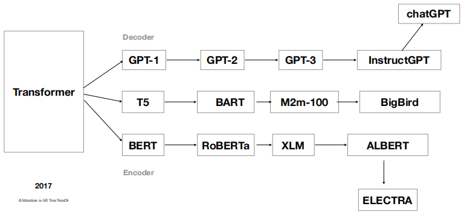

自**2017年**推出之后， Transformer 已经形成了自己的家族体系。

> 2017年，Google发表《Attention is all you need》，完全使用 Attention 机制的 Transformer 模型开始主导 NLP 领域。

基于GPT架构，**ChatGPT**就隐藏在**GPT-3**的后面。

#### RLHF技术

根据 OpenAI 的介绍，ChatGPT是在2022年初训练完成的GPT-3.5系列模型的基础上调优而来。ChatGPT使用了与另一款GPT-3.5系列的模型InstructGPT相近的方法——**基于人类反馈的强化学习**（Reifocement Learning from Human Feedback，RLHF）。团队收集了AI与人类对话的数据，既包括人类自己的也包括AI的， AI 训练师可以参照建模建议写出自己的答案。

对于强化学习奖励模型，OpenAI 记录了 AI 训练师和聊天机器人之间的对话。然后，该团队随机选择了一个人工智能利用不同自动补全功能生成的回复，并让训练师对其进行评分。在进行微调时，OpenAI 使用了**近端策略优化**（proximal policy optimization），这个过程会反复进行多次。

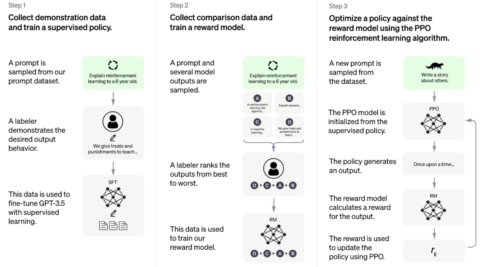

**第一步，使用有监督学习方式，基于GPT3.5微调训练一个初始模型**，训练数据约为2w~3w量级（此处为推测量级，我们根据兄弟模型InstructGPT的训练数据量级估算）。由标注师分别扮演用户和聊天机器人，产生人工精标的多轮对话数据。值得注意的是，在人类扮演聊天机器人时，会得到机器生成的一些建议来帮助人类撰写自己的回复，以此提高撰写标注效率。

以上精标的训练数据虽然数据量不大，但质量和多样性非常高，且来自真实世界数据，这是很关键的一点。

**第二步，收集相同上文下，根据回复质量进行排序的数据**：即随机抽取一大批Prompt，使用第一阶段微调模型，产生多个不同回答：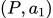,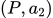,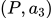…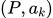，之后标注人员对k个结果排序，形成组训练数据对。之后使用pairwise loss来训练奖励模型，可以预测出标注者更喜欢哪个输出。**"从比较中"学习可以给出相对精确的奖励值**。

**这一步使得ChatGPT从命令驱动转向了意图驱动**。关于这一点，李宏毅老师的原话称，“它会不断引导GPT说人类要他说的”。另外，训练数据不需过多，维持在万量级即可。因为它不需要穷尽所有的问题，只要告诉模型人类的喜好，强化模型意图驱动的能力就行。

**第三步，使用PPO强化学习策略来微调第一阶段的模型**。这里的核心思想是随机抽取新的Prompt，用第二阶段的Reward Model给产生的回答打分。这个分数即回答的整体reward，进而将此reward回传，由此产生的策略梯度可以更新PPO模型参数。整个过程迭代数次直到模型收敛。

**强化学习算法**可以简单理解为通过调整模型参数，使模型得到最大的奖励（reward），最大奖励意味着此时的回复最符合人工的选择取向。而对于PPO，我们知道它是2017年OpenAI提出的一种新型的强化学习策略优化的算法即可。它提出了新的目标函数，可以在多个训练步骤实现小批量的更新，其实现简单、易于理解、性能稳定、能同时处理离散/连续动作空间问题、利于大规模训练。

以上三个步骤即ChatGPT的训练过程，合称为文献中提到的**RLHF技术**。

# AI+应用软件结合

## AI+工具类软件：文字、图片、音频、视频、3D模型

- 文字类：
  - Notion AI
  - Office（微软计划将ChatGPT接入）
  - 式说（第四范式）

**Notion AI能基于简单指令生成丰富的文字内容。**Notion AI是用于Notion产品的人工智能工具，通过集成机器学习和NLP技术，帮助用户提高文字创作的效率和体验。在AI大规模语言模型赋能下，用户只需要罗列出基本需求，产品即可自动生成丰富的文字内容，文字内容的类型覆盖会议议程、销售邮件、新闻发布稿等多种场景。Notion AI还拥有总结、改错、翻译、续写、头脑风暴等功能；后续Notion AI还将会成为Notion知识库的接口，用户只需要输入搜索要求，Notion AI即会自动呈现相关信息。我们预期Notion AI的自动文本生成、文本摘要、文本编辑等功能或将大大优化用户的创作流程和使用体验，帮助Notion的产品力实现跃升。

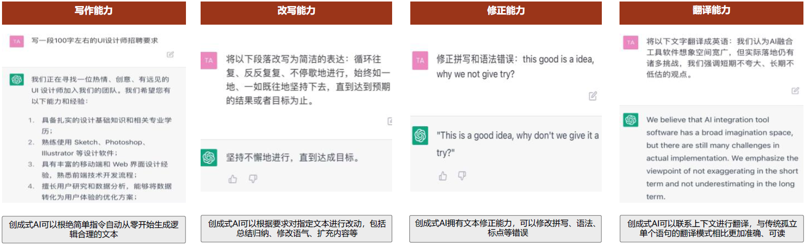

- 图片类
  - Stable Diffusion、Midjourney（Stability AI）
  - DALL-E（OpenAI）
  - Imagen（谷歌）
  - 天工巧绘（昆仑万维）
  - 万兴爱画（万兴科技）

**DALL·E** **DALL·E由OpenAI率先推出，并于2021年通过Azure OpenAI服务开始将其技术商业化，2022年4月发布升级版DALL·E 2。**凭借OpenAI在2021年发布的基于GPT-3的图像文本匹配模型CLIP，DALL·E 2具备了联系文本和视觉图像的能力；又通过基于Diffusion的图像生成模型GLIDE，DALL·E 2能够按照文本生成逼真的图像，分辨率提升了4倍，准确率更高，并且业务更广，具备三种功能：1）根据文本提示生成图像，2）以给定图像生成新图像，3）以文本编辑图像元素。

- 音频类

  - AudioLM、MusicLM（谷歌）

  - VALL-E（微软）
  - Dance Diffusion（Stability AI）
  - Jukebox（Open AI）
  - 讯飞配音
  - 百度语音合成
  - 腾讯智影

**MusicLM：**这是一种从文本描述中生成高保真音乐的模型，例如用户可以输入“平静的小提琴旋律伴随失真的吉他即兴演奏”。MusicLM将条件音乐生成过程转换为层次化的Seq-to-Seq建模任务，并能够保持24 kHz的频率生成一段几分钟的音乐，无论是文本描述还是音频质量都优于之前的模型。此外，MusicLM还能够基于文本的描述转变原来的旋律、根据图片画作和文字描述生成对应的音乐伴奏。

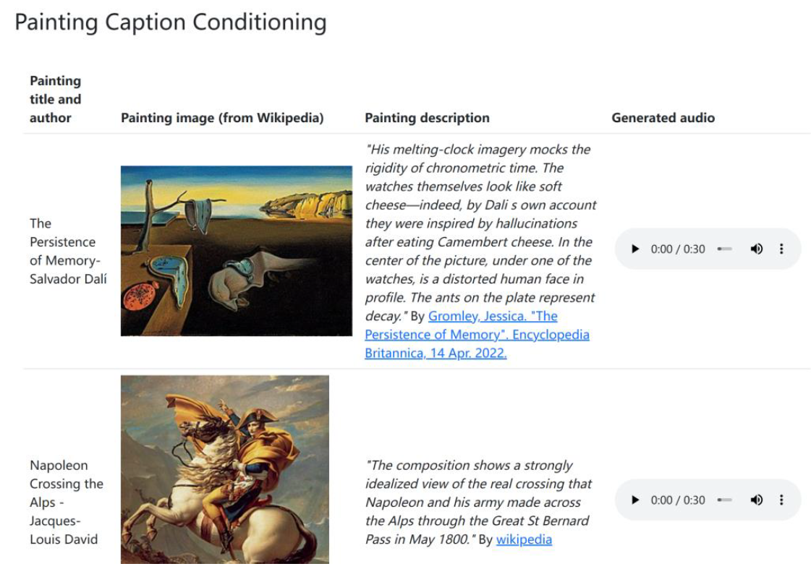

- 视频类
  - Designs.ai
  - Make-A-Video（Meta）
  - Lumen5
  - Imagen Video、Phenaki（谷歌）
  - GEN-1（Runway）
  - 万兴播爆（万兴）
  - VidPress（百度）
  - 商汤智影

**Make-A-Video能够基于文本生成视频。**Make-A-Video是2022年7月Meta发布的文本生成图像模型Make-A-Scene的进一步升级。通过向Make-A-Video输入文本即可生成数秒的视频，支持不同的视频风格。除了文本生成视频，Make-A-Video还能够实现输入单个或两个图像来创建运动，即图像生成视频。

**图表：通过向 Make-A-Video 输入文本生成的视频**

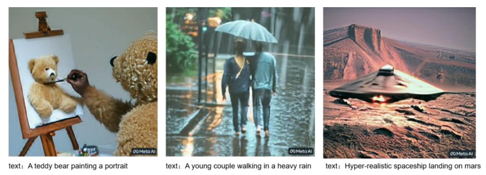

- 3D模型
  - Creo
  - Autodesk Fusion360
  - Solid Edge
  - Solidworks

## AI+搜索引擎：借助自然语言处理将传统的搜索点击转变为互动问答形式，并生成个性化结果

- 微软：NewBing 搜索引擎
- Google：？
- 百度：文心一言

# 机遇与挑战

## 业务篇

### 产品结构

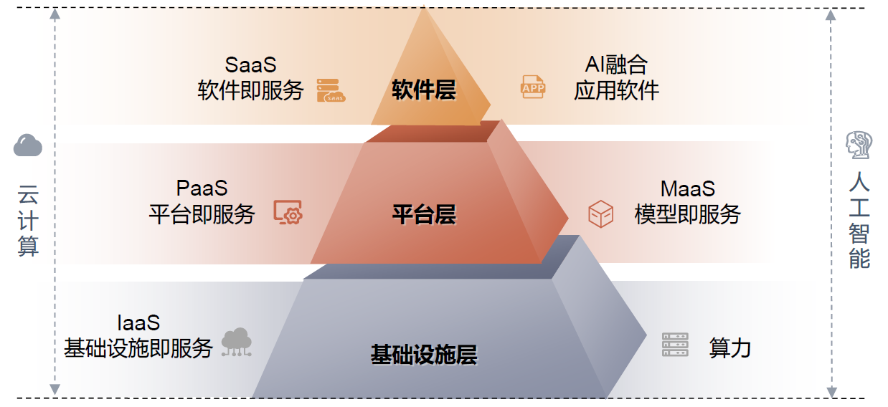

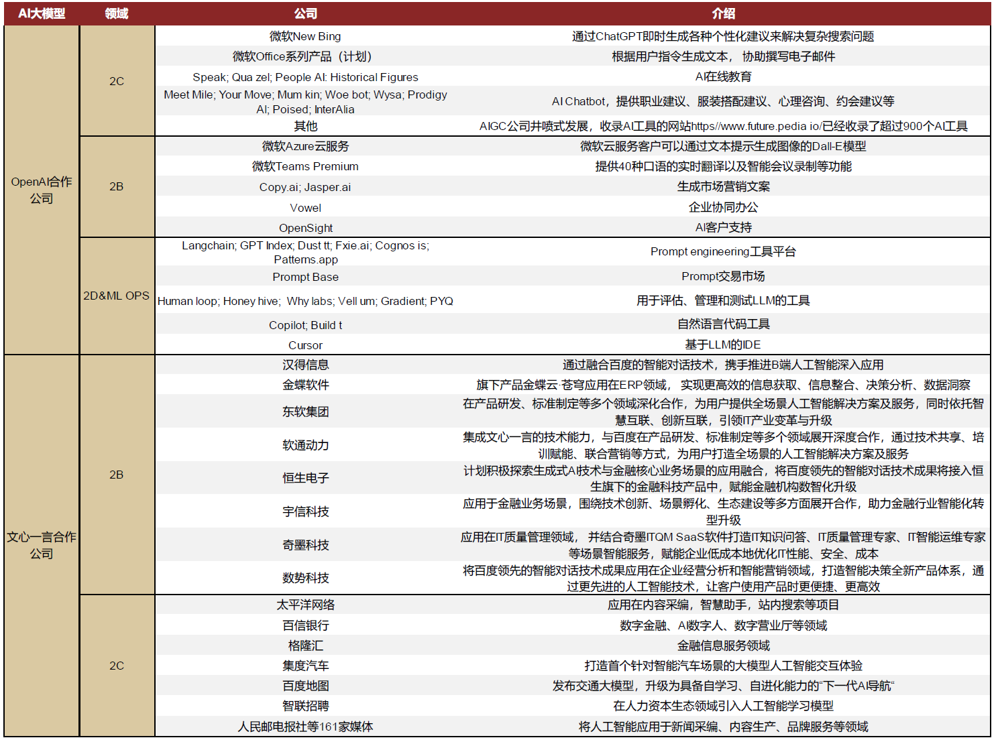

### 商业逻辑

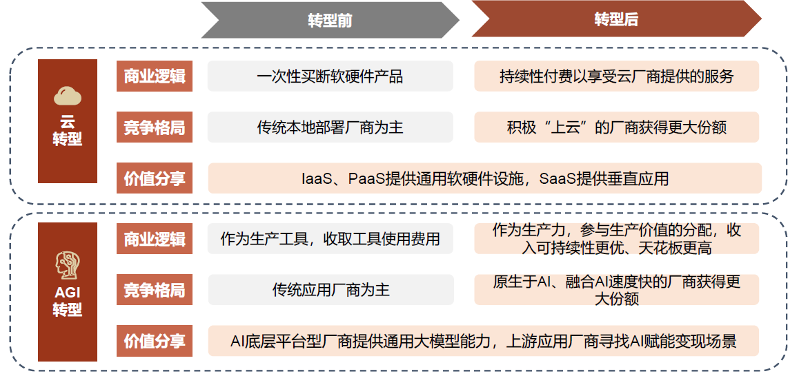

### 技术革命

我们将AGI看作一个新的技术革命，可能对传统产业格局带来冲击。类比云计算时代，Salesforce等新兴SaaS厂商把握“上云”新趋势，异军突起“超车”SAP等老牌软件厂商；而Oracle、微软等传统厂商的云转型成效也直接影响其市场影响力演变趋势。事实上，目前已有一批AIGC相关独角兽正快速发展，在未来的AI融合应用时代，我们认为原生于AI的新兴厂商的出现及传统厂商AI转型效果都可能给现有的竞争格局带来改变。

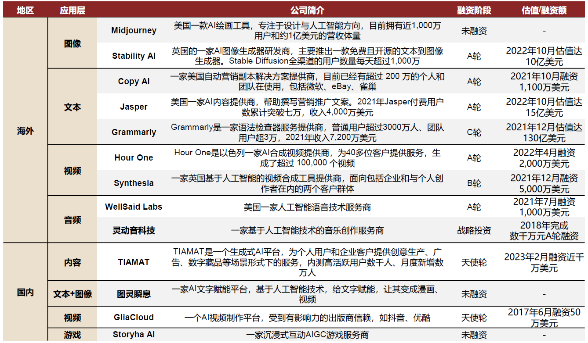

### 业务拓展，借鉴和使用ChatGPT

对于ChatGPT的借鉴和使用，大致可以归类以下四个方向：

- **直接使用层面**

此层面为复用API中效果极佳的部分，直接使用的优势是可以快速实现多粒度多层级功能需求。在很多需求难以定义清晰、数据难以获得的情况下，复用并包装这样的功能一本万利。

当然其缺点也很明显。直接调用成本是极高的，根据GPT3.5(Davinci)的成本推测:1k tokens≈700 words为0.02美元。换算后，一篇2k字的文章直接调用需要0.4人民币。若保守按照日活1w用户、人均10篇文章计算，则每日调用成本为：10000*10*0.4=40000元。虽成本过于高昂，但实现时间最少。

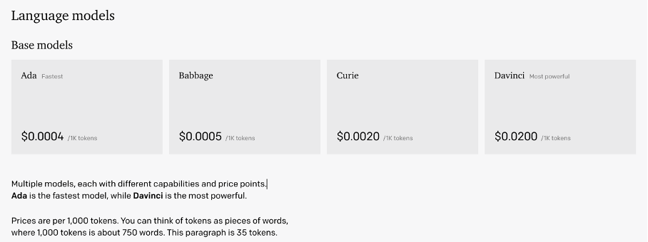

另外，根据Musk Twitter上与OpenAI工作人员的对话，也可以**看到每次聊天过程需要几美分的成本，所以ChatGPT直接调用成本极高。**

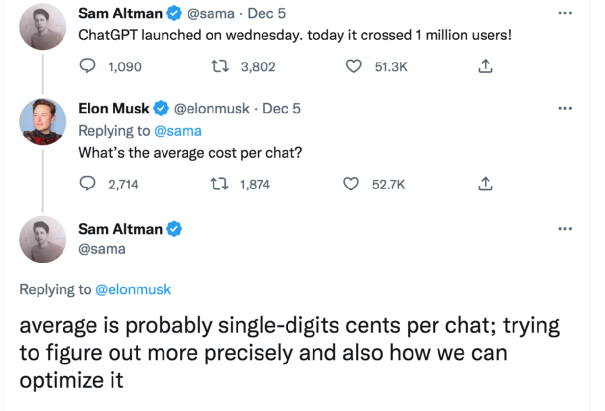

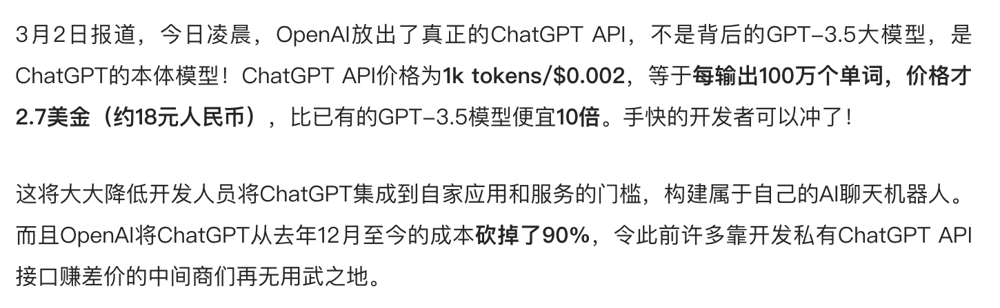

- **间接使用层面**

此层面核心思想是利用OpenAI接口，按照不同需求生成高质量数据，克服现有数据难获得的瓶颈；进而利用现有开源大模型进行数据扩增，这是目前比较切实，实现时间较少，是在时间成本和效果上折中的方式。

- **思想借鉴**

首先，组内目前有初步尝试参考RLHF的方法，如对多候选进行标注、利用得到的标注结果重新微调生成模型、或者增加排序阶段加入RL学习。其次，我们也尝试一些高效调参的方法微调现有大模型。但此条受限于资源尚需评估和确认。

**总的来说，将改写从最初的seq2seq，拓展到GPT+Instruction Tuning路径。**

实现时间：（1）< (2) < (3)

资源成本：（1）> (3) > (2)

- **交互升级**

将写作整体打造为ChatBot的形式，此核心思想见另一篇关于对话系统报告中的介绍，涉及到交互层面的变革。但ChatGPT的出现和核心技术让形式升级成为可能。随着深度学习和多智能体系统的发展，未来会有多种、多样、多功能的X-Bot出现。

## 个人篇

### 专业

### 思辩

- 无法理解人类语言和文化；
- 不能展现人性，感到人的温暖；
- 其实chatgpt的回答就是一套结构化的语言，什么是结构化语言：情况就是这么个情况，具体什么情况还得看情况。
- 注意ChatGPT火的原因，是事件火还是技术本身；
- 长尾问题回答的不好；
- ……

> 以下摘录自《阿兰·图灵：计算机器与智能》

　　 现在，我们认为基础已经打好，并准备就“机器能否思维？”这个问题继续进行辩论……我们不能全盘摒弃最初的那个问题形式，因为在考虑代换是否恰当这个问题时，会有不同的意见，因此，我们至少必须考虑这方面必须说些什么。

　　 我想要是我先就这个问题阐述一个自己的看法，那么，读者就会觉得问题会更简单一点。

　　 首先让我们来看看这个问题的更确切的形式。我认为在 50年的时间里，计算机的信息存储量可达到大约 10^9^，这样的话，计算机在模拟游戏中就会很顺利，一般的提问者在  5分钟提问后，能准确鉴别的概率不会高于  70％。原来那个“机器能够思维吗？”的问题我认为没有什么意义，不值得讨论。然而，我认为本世纪末，由于词汇用法会有较大的变化，普遍的学术见解也会改变，那时候人们又能重新谈思维机器而不会自相矛盾。我还认为，如果掩盖这些看法，决不会带来任何益处。人们普遍认为，科学家进行科学研究工作，总是从可靠的事实到可靠的事实，从来不受任何未经验证的假设的影响。这种看法实际上是错的。假如能清楚地划分哪些是经过证实的事实，而哪些又是未经验证的假设，那也没有什么害处。**假设往往是非常重要的，因为它们为研究暗示了有益的研究方向。**

　　 我现在谈谈与我的看法相对立的观点。

#### 来自神学的反对意见

　　 （１）来自神学的反对意见。思维是人的不朽灵魂的一种功能。上帝赋予每一个男人和女人以一颗不朽的灵魂，但从未将它赋予任何其他的动物或机器。因此，动物或者机器不能思维。

　　 尽管我不能接受这种看法，但我试图用神学的语言来回答这个问题。如果将动物和人划为一个类别，我认为这个观点更有说服力；因为，在我看来，生物与非生物之间的差别远远要比人和其他动物之间的差别大得多。如果这种正统的观点出现在其他宗教社会里，它的主观武断性就更加明显了。**伊斯兰教认为妇女没有灵魂，基督教对此有何感想？**但是，现在暂不管这一点，让我们回到问题的焦点上来。在我看来，上面所引的论点对上帝威力的万能性有很大的限制。上帝对有些事情也是无能为力，比如，无疑他不能让１等于２；但是，我们难道不应该相信，要是上帝觉得合适，他完全可以赋予一头大象以灵魂吗？我们可以希望，上帝可以通过自己的威力造成变种，由于变种，大象有了一个较发达的大脑，可以用来满足灵魂的需求。同一形式的论点也可以用来解释机器。只是看上去也许有点不一样，因为“轻信”就不那么容易了。但这其实只能说明，我们认为上帝不太可能觉得这些环境适合于授予灵魂。关于环境问题我们将在本文的其余部分进行讨论。在企图制造这样的机器时，我们不应该无礼地篡夺上帝创造灵魂的权力，就像不应该剥夺我们生儿育女的权力那样；在两种情况下，**我们其实都是上帝意志的工具，为他所创造的灵魂提供住所。**

　　 然而，这仅仅是猜想而已。不管能用神学的论据来证明什么，我仍不以为然。过去已经证明这样的论据是漏洞百出的。在伽利略的时代，就有人提出，“太阳一动不动地悬着……整天都不慌不忙，不想落下”（《约书亚书》，10。13）以及“他为大地奠定基础，叫它永远不动摇”（《诗篇》，105。5)这些经文正好用来驳斥哥白尼的理论。从我们今天的知识来看，就觉得提出这种论据是徒劳的。过去没有这样的知识，情况便大不一样了。

#### 所谓”鸵鸟政策”式的异议

　　 （２）所谓”鸵鸟政策”式的异议。”机器思维后果太令人恐惧了。但愿机器永远不会有思维。”

　　 这种观点不如上面的说法那样直言不讳。但它对我们许多人都有影响。我们都倾向于认为人类的某个微妙的方面比其他生物要优越。要是能证明人一定是高一等的，那再好不过了，因为那样的话，他高居一切之上的地位就不会有危险了。神学的论点那样流行，很明显是与这种情绪密切有关。这种看法在知识分子中会更普遍，因为他们比其他人更尊重思维能力，因此也就对人类思维能力的优越性更加深信不疑。

　　 我认为这个论点不怎么重要，不值得一驳。安慰一下也许更合乎情理；这种安慰也许能在灵魂轮回说中找到。

#### 来自数学的异议

　　 （３）来自数学的异议。在数学逻辑里有一些结论，可以用来证明离散状态的机器的能力有一定限度。这些结论中最著名的是哥德尔定理，此定理声称，在任何一个足够有力的逻辑系统里，都能形成陈述，而所作陈述在本系统范围之内既不能被证明是对的，也不能被证明是错的，除非这个系统本身就不一致。丘奇、克利恩、罗瑟和图林等人也有别的在某些方面同哥德尔定理很相似的结论。图林的结论更容易考虑，因为它直接涉及机器，而其他人的结论相对来说是间接的：比方说，如要使用哥德尔定理，我们还需要某些附加手段，通过机器来描述逻辑系统，而要描述机器还需要再通过逻辑系统。这个结论涉及一种机器，它实质上是一台万能的数字计算机。即使是这样一台机器，它对有些事情也是无能为力的。如果计算机被设计成能在模似游戏中回答问题的话，那么对有些问题它是无法给予正确答复的，而对另一些问题，不管你给它多长时间，它也答不上来。当然，尽管这台机器回答不了许多问题，但另一台机器却能给予满意的解答。我们现在只假定，对这些问题只要回答“是”或者“不是”就行了，不会出现像“你认为毕加索怎么样？”这类的问题。我们知道机器必定无法回答的问题是下述这类问题：”这台机器有以下特点……这台机器会不会对任何问题作出‘是’的回答？”这里省略的是对某台标准形式机器的的描述……如果所描述的机器与那台被提问的机器具有某些相对简单的联系，那么，我们就能知道，答案不是错了，就是压根儿没有答案。这就是数学的结论，此结论认定机器能力有限，而人类智能则没有这种局限性。

　　 如果想对这个论点作一简要的答复，我们就能指出，尽管它已经证明任何一台特定的机器都是能力有限的，**但它并没有任何证据说，人类智能就没有这种局限性**。但我认为这个论点不能就这么轻易了结。每当其中一台机器遇到一个合适的问题，并作出我们明知是错的回答时，我们无疑会产生一种优越感。这种优越感难道不会是错觉吗？这种感觉无疑是真实的，但我觉得这并没有多大意义。我们自己平时也经常对问题作出错误的回答，因此，就没有权利因机器犯了错误而沾沾自喜；当然，我们对付一台机器当然易如反掌，但我们无法同时对付所有的机器而且不出差错。**一句话，有可能人比一台特定的机器聪明，但也有可能别的机器更聪明**，如此等等。

　　 我认为，那些持数学异议的人大多数愿意接受模似游戏作为讨论的基点。而持前两种反对意见的人不大会对什么标准问题感兴趣。

#### 来自意识的论点

　　 （４）来自意识的论点。这个论点在斐逊教授 1949年的李斯德演说中阐述得很明确，我摘引了其中的一段话：“若要我们承认机器与大脑是一样的，除非机器能够因为感受了思想与感情，而不是符号的偶然涂抹写出十四行诗或协奏曲来。也就是说，它不仅写了，而且也应知道自己确实这样做了。任何机器都感觉不到（不只是属于简易发明之类的人工信号）成功的喜悦，也不会因困难而沮丧，因受奉承而沾沾自喜，因犯错误而闷闷不乐，因见异性而神魂颠倒，也不会因欲望得不到满足而暴跳如雷或一蹶不振。”

　　 这个论点看上去否定了我们测试的有效性。按照这种观点的最极端形式，你若要肯定一台机器是否能思维，唯一的途径就是成为那台机器并且去感受自己的思维活动。这样的话，他就能够向众人描述他自己的感觉，当然，没有人会知道这些话是不是实话。同样，依照这个观点，要想知道某人是否在思维，唯一的途径就是成为那个特定的人。这实际是唯我论的观点。这也许是符合逻辑的，但若真是这样，那思想交流就太困难了。Ａ会说，“Ａ在想，而Ｂ不在想”。而Ｂ会说，“Ｂ在想，而Ａ不在想。”我们犯不着为这个观点争执不休，我们不如客客气气地认为大家都在想。

　　 我肯定斐逊教授不愿意采纳这样一个极端的唯我论的观点。他倒有可能愿意把这个模似游戏当作一个测试。模拟游戏（省略了游戏者Ｂ）在实际中经常采用”口试”形式，来鉴定某人的真的理解了，还仅仅是“鹦鹉学舌”，让我们看一看这种“口试”的情形：

　　 提问者：你的十四行诗的第一行是这样的，“我欲比君为夏日，如何？”要是将“夏日”改成“春日”，是不是也可以，或许会更好？

　　 证人：这样一改便不合韵了。

　　 提问者：改为“冬日”怎么样？这样也会合韵。

　　 证人：是没问题。但是有谁愿意将自己比作冬日呢？

　　 提问者：你认为匹克威克先生会使你联想起圣诞节吗？

　　 证人：在一定程度上，会的。

　　 提问者：但是圣诞节是在冬天，我认为匹克威克先生对这个比喻不会在意。

　　 证人：我在想你也许在开玩笑。冬日的意思是指某一个典型的冬日，而不像圣诞节那样特殊的一天。

　　 这里不再赘引。如果那台写十四行诗的机器在这场“口试”中能够这样对答，杰斐教授会作何感想呢？我不知道他是不是会认为，机器只是在“机械地通过发信号”而作出这些答复；但是，如果这些答复如上面所引那样令人满意，前后一致，我认为他不会再把机器当作“一个属于简易发明之类的人工信号”。所谓“属于简易发明的人工信号”指的是一架机器的一些设计功能，可以用来播放一个人念十四行诗的录音，只要拨动键钮，你随时都可以听到这段录音。

　　 综上所述，我认为大部分支持来自意识的异议的人都可以**经过劝说而放弃原来的主张，不致于陷入唯我论的困境**。这些人因此也就有可能愿意接受我们的测试。

　　 我并不想给大家留下这样一个印象，即我认为意识并没有什么神秘之处。比方说。要想确定意识在人体中的位置，就是一个谜。但是，如果我们没有解决这些谜，还是能够回答这个与本文有关的问题的。

#### 来自种种能力限制的论证

　　 （５）来自种种能力限制的论证。这些论证一般是这样一种说法：“我担保，你可以使机器干任何你刚才提到的事情，可你永远也不能使一台机器有Ｘ类的行为。”这类行为包括许多特征。我在这里援引一例：

　　 要和蔼、机灵、美丽、友好……富于首创精神、富于幽默感、善于明辨是非、会犯错误……会坠入情网，喜欢草莓和奶油……能使别人钟情于它，通达世故……措词得当，长于反思……像人一样行为多姿多彩，富于创新……

　　 说这些话一般都用不着证明。我认为这些话都是以科学归纳的原则为基础的。一个人在他一生中看到过成百上千台机器。他由所见所闻得出一些普遍的结论。它们形态丑陋，应用范围狭窄，只要范围略有变动，它们就束手无策。此外，它们的行为方式也非常单一，等等，等等。他很自然地认为，这就是机器大体上的必备特征。大部分机器的能力限制与机器储存量太小有关（我在设想，储存量这个概念可以通过某种方式进行扩充，它不仅仅包括离散状态的机器，也包括其他机器。因为目前讨论还不需要讲究数学的准确性，所以定义准确问题并不要紧）。数年前，由于数字计算机在社会上还鲜为人知，要是你光说其特征而不提其构造，那么，你们就会以为你在信口开河。我想这也是因为人们使用了科学归纳原则的结果。当然，人们在使用这个原则时，大都是无意识的。一个小孩一朝被火烫，十年怕烛台，我认为他这就是在使用科学归纳（当然，我也可以用许多别的方式来解释这一现象）。人类的行为和习惯看上去不适合运用科学归纳。如果你想获得可信赖的结果，你就要对时空的大部分进行研究。要不然的话，我们会（就像许多说英语的儿童那样）以为世界上所有的人都讲英语，再去学法语真是傻透了。

　　 然而，关于我们刚才提到的许多能力限制，还要特别说几句，说机器没有能力享受草莓和奶油，这种说法会使读者觉得有点轻率。我们有可能使机器喜欢这些美味，但任何强迫这样做的企图都是愚蠢的。值得重视的是，这种能力限制对解释其他能力限制也有影响。比如，难以使人与机器之间形成那种像白人与白人之间，或是黑人与黑人之间的友好情感。

　　 认为“机器不会出差错”这种想法有点令人费解。我们不禁要反问：“它们出了错就更糟了吗？”让我们站在同情的立场上，看看这究竟是什么意思。我想我们可以用模拟游戏来解释这种说法，有人声称，在游戏中提问者可以向被试问几道算术题来分辨是哪个机器，哪个是人，因为机器在回答算术题时总是丝毫不差。这种说法未免太轻率了。（带模拟游戏程序的）机器并没有准备给算术题以正确的答案。它会故意算错，以蒙骗提问者。机器在做算术题时，由于对要出现什么样的错误作出了不妥当的决定，因而显示了机械的故障。我们对这种观点作这样的理解，其实也不太富有同情心。但是，我们对这个问题限于篇幅不可能进一步讨论。在我看来，这个观点的根源在于混淆了两个不同性质的错误。这两个错误我们称之为“功能错误”和“结论错误”。功能错误是由某些机械或电器故障引起的，这些故障导致机器不能够按照指令工作。在进行哲学讨论时，我们很容易忽视发生这种错误的可能性；这样的话，我们实际上是在谈论“抽象的机器”。而这些抽象的机器与其说是实在的物体倒不如说是数学的虚构。从定义上讲，我们完全可以这么说：“机器从不出差错。”当某一意思与来自机器的输出信号联在一起时，就会产生结论的错误。比方说，机器能够自动打出数学方程或英语句子。当机器打出一个错误的命题时，我们就认为这台机器犯了结论错误。很明显，找不到丝毫理由说，机器从不犯这类错误。一台机器有可能别的什么也不能做，只会连续打出“0＝1”。举这样一个例子也许太过分了，我们可以换一个例子：机器会想办法通过科学归纳来得出结论。这种办法有时无疑会导致错误的结果。

　　 有人说，机器不能成为它自己思维的主体。如果我们能证明机器的某些思维是有某些主题的话，我们就能驳回这种说法。尽管如此，“机器活动的主题”确实有点意义，至少对于研究它的人来说是这样的。比如，如果一台机器试图解 X^2^-40X-11＝0这个方程式，我们不禁会认为，这时，这个方式本身就是机器主题的一部分。从这种意义上说，机器无疑能够成为它自己的主题。这对编排它自己的程序，对预测因本身结构变化带来的后果都会有所帮助。机器能够通过观察自己行为的结果，修改自己的程序，以便更有效地达到某种目的。这并不是乌托邦式的空想，而是不久的将来可能办到的事。

　　 有人批评说，机器的行为比较单一。这也就是说，机器不能够有很大的存储能力。直到最近，达到 1000字节的存储量都很罕见。

　　 我们现在这里考虑一些反对意见实际上是都是来自意识的那个异议的改头换面。通常，如果我们坚持认为，一台机器有能力做完其中的一件事，并对机器所能采用的方法进行描述。那么，不会给别人多深印象。人们会认为机器所使用的方法（不管是什么方法，总是机械性的）实在太低级了。请参见前面所引斐逊演讲中括号内的话。

#### 洛夫莱斯夫人的异议

　　 （６）洛夫莱斯夫人（译注：爱达，第一个程序员）的异议。

　　 洛夫莱斯夫人的回忆录中曾对巴比奇的分析引擎作过详尽的记述。她这样写道：“分析引擎没有任何意图要想创作什么东西。它能做我们知道该怎样去指挥它做的任何事。”（重点为她所知）哈特里引用了这段话，并补充道：“这并不是说，就不可能制造能‘独立思考’的电子设备，（用生物学的话说）在这种设备里，我们能够引起可以用来作为‘学习’基础的条件反射。从最近的一些发展情况

　　 看，这种设想从原则上说是不是有可能，已经引起人们的极大兴趣和关注。但是，当时制造的那些机器并不具备这些特点。”

　　 在这点上我完全同意哈特里的看法，我们会注意到，他并没有断言当时的机器还不具备这个特点，他倒是指出了，洛夫莱斯夫人所能获得的证明还不足以使她相信这些机器已具备了这个特点。从某种意义上讲，这些机器已具备了这个特点，这是极有可能的，因为，我们可以设想某些离散机器有这个特点。分析机实际上是一台万能数字计算机。因而，如果它的存储能力和速度达到一定水准，我们就能通过适当的程序使它模仿我们讨论的机器。也许伯爵夫人或巴贝奇都没有想到这一点。无论怎么说，他们不必能提什么要求，便提什么要求。

　　 洛夫莱斯夫人的异议还有另外一种说法，即机器“永远也不能创新”。这种说法可以用一句谚语“世上无新事”抵挡一阵。谁能保证，他的“独创性成就”就不是接受教育的结果，就不是因循著名的普遍原则的结果？这种异议还有另一个稍稍好一点的说法，即机器永远也不能“使我们惊奇”。这种说法有点直截了当，我能够针锋相对地加以反驳。机器经常令我吃惊。这主要是由于我对机器能做什么估算甚少，更确切地说是由于即使我做了估算，也匆匆忙忙，马马虎虎。我也许这样对自己说：“我认为此处的电压应与彼处相同；不管怎么样，就当是一样吧。”我自然经常出错，结果我大吃一惊，因为一俟实验完成，这些假设早被忘得一干二净了。我对自己的这些错误开诚布公，但在我证实了所惊讶的事时，人们也不会认为我在信口开河。

　　 我的回答并不会使批评者就此缄口沉默，他也许会这样做，所谓大吃一惊都是因为我自己富于想象力的心理活动，与机器本身毫不相干。这样，我们重又回到来自意识的那个论证上去，而背离了吃惊不吃惊的话题。我们不得不认为这种论证方式是封闭式的，但是，也许值得一提的是，要将某物认作会使人惊奇的，则需要许多“富于想象力的心理活动”，不管这件令人吃惊的事件是由一个人、一本书、一台机器还是任何别的东西引起的。

　　 我认为，那种认为机器不会令人吃惊的观点是由这样一个为哲学家和数学家特别容易犯的错误引起的。它是这样一个假设，即心灵一接受了某个事实，由此事实所引起的一切后果都会同时涌入心灵。在许多情况下，这种假设十分有用，但是，人们会情不自禁地忘了这是个错误的假设。如果照这样做的话，其必然结果就是认为，仅仅从数据和普遍原则得出结论会毫无效力可言。

# 结语：ChatGPT 通过图灵测试了么？

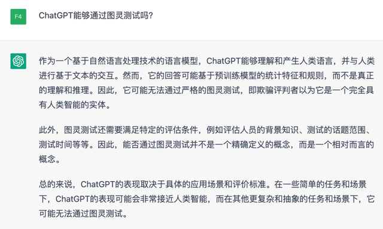

> 或许，答案本身已经不重要了……

# 参考文献

1. [人工智能见证了人类所有的自虐](https://mp.weixin.qq.com/s/sboJPibFQ9K36yg9hPmkPQ)
2. [ChatGPT深度解析：GPT家族进化史](https://mp.weixin.qq.com/s/ooboOdMNOlRw7VgAH0O4mQ)
3. [ChatGPT-地表最强AI模型！要消灭人类？](https://mp.weixin.qq.com/s/ooboOdMNOlRw7VgAH0O4mQ)
4. [中金 | AI十年展望（六）：ChatGPT兴起，创成式AI能否重塑工具软件底层逻辑？](https://mp.weixin.qq.com/s/JFSN1NvoaH9fdrXYHf8B0Q)
5. [Transformer——ChatGPT幕后的真正大佬](https://mp.weixin.qq.com/s/wTa5KtjEMGGHx7KmiYc3Rw)
6. [《InstructGPT》](./local.assets/InstructGPT 论文.pdf)
7. [计算机器与智能](https://www.aisixiang.com/data/97818-2.html)

