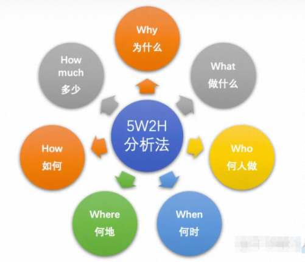
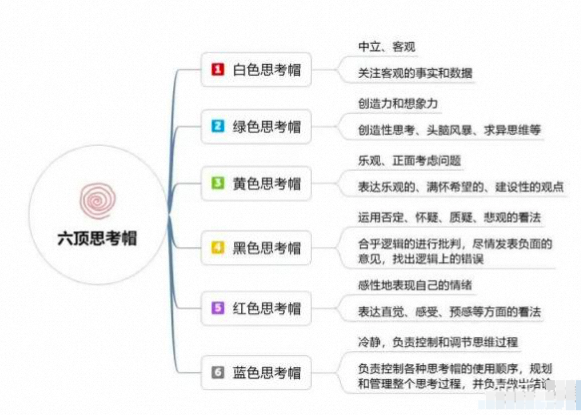
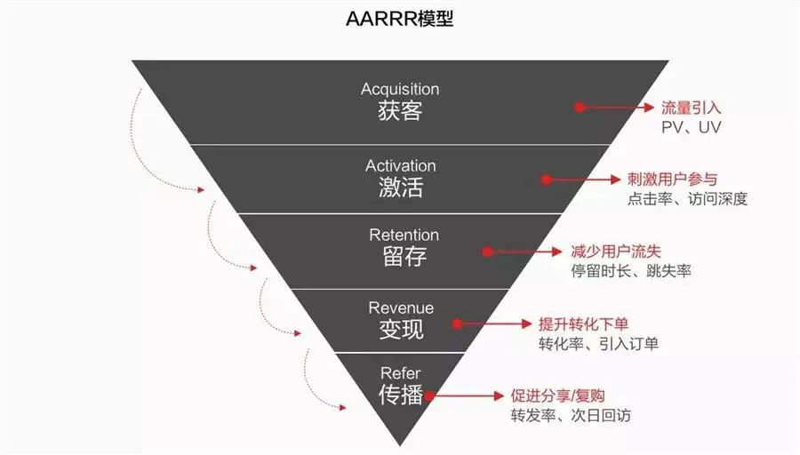
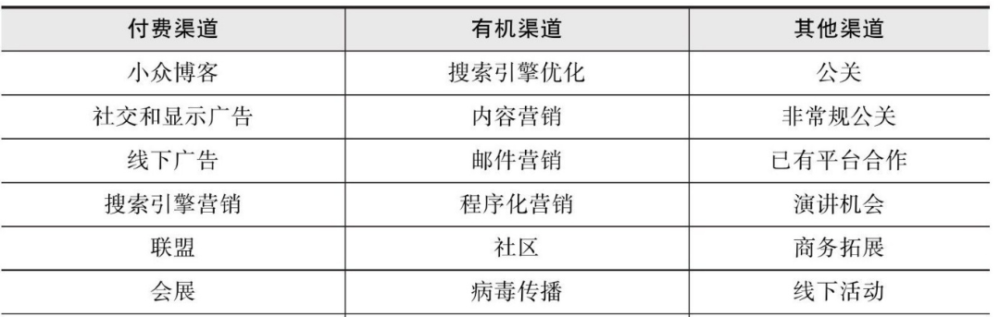
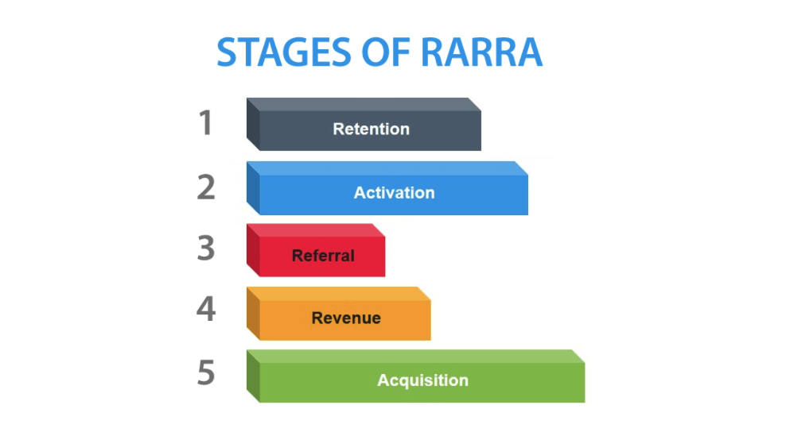

<!--more-->
<!-- 1. 发布前：删除草稿的 uuid -->
<!-- 2. 发布后：补充tag，category -->

> 注：本文转自公众号文章[《这些年在阿里学到的方法论》](https://mp.weixin.qq.com/s/yPRPakU1UM5iVY-1bwiHJQ)

> 本文从做事方法、思维方式、目标管理、数据分析、用户增长几方面介绍了相关的方法论，希望能给读者带来一些帮助！

方法论是指导做事的基本原则，能够帮助我们快速的触及问题的核心并确定解决思路，好的方法论能让我们事半功倍，下面就总结下我在阿里这几年学习到的部分方法论。

## 做事方法论

### **5W2H**

我们在做一件事时，经常需要和老板或者合作方去讲为什么要做这件事，准备怎么做，以求获得来自老板和合作伙伴的认可及支持。5W2H是指WHY、WHAT、WHO、WHEN、WHERE、HOW、HOW MUCH。5W2H方法可以帮助我们搭建出一个清晰的表达框架，让表达的重点突出，易于理解，下面就对5W2H做个详细的介绍。

WHY：以前在学校里写论文时，首先需要阐述的就是整篇文章的动机。同样地，在进行述职或晋升答辩时，也要向大家讲明白做一件事的原因和收益，如果回答不好这个问题，那你所做的事情就可能被质疑是没有价值的；

WHAT：当我们想清楚了了做一件事情的原因，接下来要确定的就是做什么，以及目标是什么；

WHO：想要做成一件事情，除了自己，通常需要其他人协同完成，越是复杂的事情，需要协同的人员越多。此时，需要做到权责分明，确认好任务的一号位及所有人的分工；

WHEN：做事情，通常我们会有长期目标和短期目标。在什么时间点完成什么样的事情需要一开始就确定好，后续才能以此为目标进行推进；

WHERE：确定做一件事情的地点，如果涉及横跨多个地域的合作项目，需要考虑人员的办公地点，必要时需考虑出差；

HOW：做一件事情的具体方法和步骤；

HOW MUCH：做一件事情的开销，包括人力、资源等各方面成本。做一件事情时，我们要考虑投入产出比，对于成本高收益小的事情，就需要再进一步对焦是否有继续推进的必要了；

很多简单的事情即使不按上述流程分解我们也能很好的完成，但对于复杂的问题，如果没有成体系的方法作为参考，那事情就很难做成。在日常工作中，即便是小的事情，我们也可以按这种流程推进来培养自己做事的能力，这样在遇到复杂问题时，就能够很从容的做到抽丝剥茧，化繁为简。

### **STAR**

STAR是一种帮助讲述故事的法则，可以让问题的描述更加清晰易懂，在面试过程中常常使用。STAR法则是情境(situation)、任务(task)、行动(action)、结果(result)的缩写。

情景：事情发生的背景和环境；

任务：承担的任务或职责；

行动：为了实现目的采取的措施；

结果：最终得到的成果；

学会STAR法则可以帮助我们更好的表达，让别人更好的接受。既要能做，也要会说！

### **帕累托原则**

帕累托原则又叫做二八原则，用于量化投入与产出之间的关系。意大利学者帕累托发现社会财富在人口中的分配是不平衡的，20%的人占用了80%的社会财富，而这种不平衡现象在社会中普遍存在，因此二八原则就成了这种不平衡关系的简称。理解帕累托原则，可以帮助我们抓住问题的核心，通过优化核心的20%达到80%的效果。

### **长尾理论**

长尾理论和帕累托原则相反，认为80%长尾可以积累成很大的份额，针对长尾进行优化有很大的提升空间。对于帕累托原则和长尾理论的应用，需要结合实际场景进行分析，两种理论没有对错之分，只是在合适的时间做合适的事。

## 交付方式

### **MVP**

MVP（Minimum Viable Product）即最简化可实行产品，其核心思想是每次交付给用户的是一个最小可用的功能集合，根据交付后的用户反馈不断迭代，并最终转化成一个完整的产品。通过这种方式能够以最低的成本快速进行产品验证，避免投入大量资源后再进行产品方向调整。

## 思维方式

### **六顶思考帽**

“六顶思考帽”(Six Thinking Hats)是爱德华·德·波诺(Edward de Bono)博士开发的一种思维训练模式，或者说是一个全面思考问题的模型，提供了“平行思维”的工具，避免将时间浪费在互相争执上。

其核心思想在于从不同的角度思考同一个问题，每次只思考一个方面。它用六顶颜色不同的帽子作为比喻，把思维分成六个不同的方面，使每一个人在思考问题时都可以扮演六种不同的角色。

### **第一性原理**

第一性原理最早来自于古希腊哲学家亚里士多德，他说：“在每个系统中存在最基本的命题，它不能被违背和删除。”

马斯克非常崇拜第一性原理，他曾说过：我们运用“第一性原理”思维而不是“比较思维”去思考问题。我们在生活中总是倾向于比较--别人已经做过了或者正在做这件事情，我们就也去做。这样的结果是只能产生细小的迭代发展。“第一性原理”的思考方式是用物理学的角度看待世界的方法，也就是说一层层剥开事物的表象，看到里面的本质，然后再从本质一层层往上走。

### **SCQA**

麦肯锡大法——金字塔模型中一个结构化表达方法，即情境（Situation）、冲突（Complication）、问题（Question）、答案（Answer）。在使用SCQA时，并不需要严格按照“情境-冲突-疑问-答案”的顺序进行表达，而是可以调换顺序以适配不同的表达风格和情绪，一般可以分为以下4种模式：

标准式：（SCA）情境-冲突-答案；

开门见山式：（ASC）答案-情境-冲突；

突出忧虑式（CSA）冲突-情境-答案；

突出信心式：（QSCA）疑问-情境-冲突-答案。

### 金字塔原理

金字塔原理简单说就是，任何事情都可以归纳出一个中心论点，而此中心论点可由三至七个论据支持，这些一级论据本身也可以是个论点，被二级的三至七个论据支持，如此延伸，状如金字塔。

## 目标管理

### **OKR**

OKR中O表示目标Objective，KR表示关键结果Key Result。OKR自下到上聚焦，驱动员工进行创新，并在组织中共享，公开透明，可以让全体员工对组织的目标有明确的了解。OKR需持续性更新反馈，并结合实际业务进行调整，让组织和员工及时了解目标进展及风险。

### **KPI**

KPI即关键绩效指标（Key Performance Indicator)，是通过对组织内部流程的输入端、输出端的关键参数进行设置、取样、计算、分析，衡量流程绩效的一种目标式量化管理指标，是把企业的战略目标分解为可操作的工作目标的工具，是企业绩效管理的基础。和OKR相比，KPI自上而下分解，更多关注结果，一切都需要以指标形式进行量化。

KPI和OKR可以结合起来使用，KPI负责考核，OKR负责过程管理，KPI相当于仪表盘，OKR相当于导航软件。

### **SMART**

目标必须是具体的（Specific）；

目标必须是可以衡量的（Measurable）；

目标必须是可以达到的（Attainable）；

目标必须和总体目标具有相关性（Relevant）；

目标必须具有明确的截止期限（Time-bound）。

## 战略分析

### **PEST**

PEST是一种主要用于行业研究的分析工具，通过从政治（Politics）、经济（Economy）、社会（Society）、技术（Technology）几方面进行研究，可以帮助我们从宏观环境中更为系统地分析企业所面临的状况。

### **SWOT分析法**

SWOT分析将与研究对象相关的内部的优势（ Strength ）、劣势（ Weakness ）和外部的机会（ Opportunity ）、威胁（ Threats ）等通过调查的方式列举出来，再把各种因素相互匹配并进行系统分析，从而得出科学结论。

使用 SWOT 进行分析时，可以遵循四点原则。原则一：投入资源加强优势能力、争取机会（ SO : 最大与最大策略）；原则二：投入资源加强优势能力、减低威胁（ ST : 最大与最小策略）；原则三：投入资源改善弱势能力、争取机会（ WO : 最小与最大策略）；原则四：投入资源改善弱势能力、减低威胁（ WT : 最小与最小策略）

## 用户增长

### **数仓分层**

数据是进行数据分析最基础的要素，而数据仓库用于存储不同来源的数据。通常，数据会定期从事务系统、关系数据库和其他来源流入数据仓库。

构建数仓时一般可将数据分为四层，分别为原始数据层（ODS）、公共明细层（DWD）、公共汇总层（DWS）、应用数据层（ADS）。

- ODS层保存所有操作数据，不对原始数据做任何处理，要保留数据的原始性；
- DWD层的数据是经由ODS层数据经过清洗、转换后的明细数据，满足对标准化数据需求。如对NULL值处理，对数据字典解析，对日期格式转换，字段合并、脏数据处理等；
- DWS层数据按主题对数据进行抽象、归类，提供业务系统细节数据的长期沉淀。这一层是一些汇总后的宽表，是根据DWD层数据按照各种维度或多种维度组合，把需要查询的一些事实字段进行汇总统计。可以满足一些特定查询、数据挖掘应用，面向业务层面，根据需求进行汇总；
- ADS应用层是根据业务需要，由DWD、DWS数据统计而出的结果，可以直接提供查询展现，或导入至关系型数据库中使用。这一层的数据会面向特定的业务部门，不同的业务部门使用不同的数据，支持数据挖掘。

### **海盗指标—AARRR**

**概念介绍**

AARRR是McClure在2007年提出的，专注于获客(Acquisition)的用户增长模型，因为其爆炸性的增长方式通常又被称为海盗模型，其本质由Acquisition (获取)、 Activation (激活)、 Retention (留存)、 Revenue (收益)和 Referral (传播)5个阶段组成。

- Acquisition (获客)：在定位目标用户的前提下，通过线上线下的各种渠道让用户了解到产品信息，最终由潜在用户转化为实际用户的过程，衡量指标为点击数、安装量、打开率等。表格中可看到常见的一些获客渠道；

- Activation (激活)：这一阶段目标为提高用户活跃度，引导用户完成某些”指定动作”，使之成为长期的忠实用户。而“指定动作”则取决于产品的类型，有的产品只需用户在指定时间内登录就算用户活跃，而有的产品则还须完成指定的操作才算用户活跃，其衡量指标包括设备激活量、订阅量、日活跃率等；
- Retention (留存)：提高用户留存率， 这一阶段需要解决的问题是如何让用户持续的使用产品；
- Revenue (变现)：引导用户对产品产生付费行为，或通过广告展示、业务分成等方式向其他利益方收取费用，获得利益。衡量指标为付费率、付费频次、生命周期价值等；
- Referral (传播)：需要让用户将产品推荐给其他人，即在线上线下社交中的分享、互动等口碑推广，病毒式人传人实现用户爆发式增长。常用衡量指标为转发率，次日回放等。

**使用方式**

从策略的角度看，几个过程中关注的核心问题不同，可以针对性的采用不同的营销策略。

### **RARRA模型**

**概念介绍**

随着互联网的红利逐渐减少，AARRR模型不再适用当下的运营策略，这主要有几点原因。首先，随着应用市场的逐渐丰富，同类APP的竞争十分激烈，新用户的留存情况并不乐观；此外各类渠道（社交、电商）的流量成本高昂，拉新成本也日益增加。

RARRA模型是托马斯·佩蒂特Thomas Petit和贾博·帕普Gabor Papp对于海盗指标-AARRR模型的优化，相比AARRR专注于获客，RARRA模型更加突出了用户留存的重要性。

**使用方式**

留存率低的情况下的获客本质是在租用流量，只有提升用户留存才能够拥有自己的用户群，可以从以下几个步骤进行：

- 分析产品中当前留存率情况和主要用户流失节点，确定后进行针对性的产品优化；
- 进行产品功能引导，帮助用户更快速便捷的使用产品，提升用户活跃；
- 通过用户推荐等方式实现病毒式传播，例如拼多多的“砍一刀”；
- 找到合适的商业模式进行变现，例如通过商品推荐促进用户的交易，以此提升产品收益；
- 对获客渠道进行分析，找到那些带来忠实用户的优质渠道，对于付费转化率低的渠道，可以适当的减少营销投入。

### **客户价值衡量模型—RFM**

**概念介绍**

RFM模型是根据客户活跃程度和交易金额的贡献衡量客户价值的重要工具和手段。其含义如下：

- R——最近一次消费（Recency）：用户最近一次产生消费行为的时间和当前时间的间隔，可以定义为用户购买的沉默期，间隔越小表示用户活跃程度越高；
- F——消费频率（Frequency）：顾客在一定时间段内的消费次数，消费频率高表示用户忠诚度高；
- M——消费金额（Monetary）：消费金额是一段时间内交易金额，反映客户价值。

**使用方式**

RMF的使用方式有两种，一种方式为每个指标单独分析评估并执行相应策略，另一种方式为将多个指标进行结合，得到一个综合指标。

第一种方式从多个维度对客户进行分类，用户画像过于具体，在实际运营中不够通用；

第二种运用多变量综合评价和聚类分析的思想，对客户的分类更加科学。一般使用这种方法可以将客户分为六类，分别为重要价值客户、重要发展客户、重要保持客户、重要挽留客户、一般价值客户、一般发展客户、一般保持客户、一般挽留客户。

对用户进行分类后，即可进行针对性的营销，例如可以对重要挽留客户通过线上触达或线下拜访等方式，避免用户流失；对于一般保持客户，可以通过优惠券、特殊退换政策等维持用户活跃。

## 总结

本文从做事方法、思维方式、目标管理、数据分析、用户增长几方面介绍了相关的方法论，除了文中提到的内容，还有很多其他优秀的方法论，可以指导我们在工作、生活各方面不断成长，希望能给读者带来一些帮助！

---

