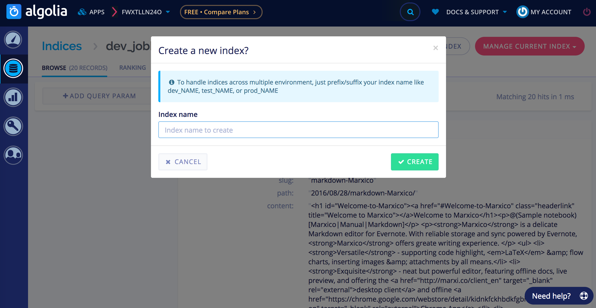

# 集成为搜索Local Search
1.安装 hexo-generator-searchdb，在站点的根目录下执行以下命令：

```
npm install hexo-generator-searchdb --save
```

2.编辑 站点配置文件，新增以下内容

```
search:
  path: search.xml
  field: post
  format: html
  limit: 10000
```

3.编辑 主题配置文件，启用本地搜索功能：

```
# Local search
local_search:
  enable: true
```

# 集成Algolia
## 1. 注册Algolia，穿件Index  
    前往 Algolia 注册页面，注册一个新账户。 可以使用 GitHub 或者 Google 账户直接登录，注册后的 14 天内拥有所有功能（包括收费类别的）。之后若未续费会自动降级为免费账户，免费账户 总共有 10,000 条记录，每月有 100,000 的可以操作数。注册完成后，创建一个新的 Index，这个 Index 将在后面使用。
    


[搜索](http://theme-next.iissnan.com/third-party-services.html)

---
<link rel="stylesheet" href="http://yandex.st/highlightjs/6.1/styles/default.min.css">
<script src="http://yandex.st/highlightjs/6.1/highlight.min.js"></script>
<script>
hljs.tabReplace = ' ';
hljs.initHighlightingOnLoad();
</script>


来源：[http://leunggeorge.github.io/](http://leunggeorge.github.io/)  